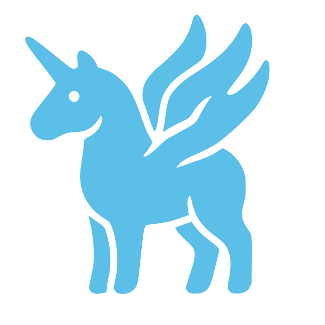

<p align="center">
  
</p>

<h1 align="center">SemaClaw</h1>

<p align="center">
  <em>A general-purpose, open-source framework for personal AI agents.</em>
</p>

<p align="center">
  <a href="LICENSE"></a>
  <a href="https://nodejs.org"></a>
  <a href="CONTRIBUTING.md"></a>
</p>

<p align="center">
  <strong>English</strong> | <a href="./README.zh-CN.md">简体中文</a>
</p>

SemaClaw is a general-purpose engineering harness for building personal AI agents. It is built on top of a reusable agent runtime ([sema-code-core](https://github.com/midea-ai/sema-code-core)) and provides the surrounding machinery — permissions, memory, scheduling, multi-agent orchestration, channel adapters, and a Web UI — that turns a raw runtime into a usable personal AI system. It is also a reference implementation and starting point for the community to evaluate and improve on the engineering decisions behind it.

---

## Highlights

- **Three-layer context management** — Unifies working context, long-term memory retrieval, and per-agent persona partitioning into a single coherent model.
- **Human-in-the-Loop permissions** — `PermissionBridge` is a native harness primitive supporting both explicit user authorization for high-risk tool actions and agent-initiated clarification requests.
- **Four-layer plugin architecture** — MCP tools, subagents, skills, and hooks — each anchored to a distinct engineering concern, forming a principled extension surface.
- **DAG Teams** — A two-stage hybrid orchestration framework combining LLM-based dynamic task decomposition with deterministic DAG execution grounded in persistent agent personas.
- **Four-mode scheduled tasks** — Pure notification, pure script, pure agent, and hybrid script-plus-agent execution — matching mode to task complexity so token consumption stays proportional to reasoning work.
- **Agentic Wiki** — Transforms task outputs into structured, retrievable wiki entries indexed alongside agent memory, creating a compounding personal knowledge base that feeds back into future agent sessions.
- **Multi-channel & Web UI** — Telegram, Feishu (Lark), and QQ adapters out of the box, plus a WebSocket gateway and a React-based Web UI.

---

## Quick Start

```bash
# 1. Clone
git clone https://github.com/midea-ai/SemaClaw.git
cd SemaClaw

# 2. Install and build
npm install
npm run build
npm run build:web

# 3. Configure
cp .env.example .env
# Edit .env — at minimum set TELEGRAM_BOT_TOKEN and ADMIN_TELEGRAM_USER_ID

# 4. Run
npm start
```

For a complete walkthrough including environment variables, CLI usage, runtime layout, and architecture details, see **[docs/QUICK_START.md](docs/QUICK_START.md)** *(currently in Chinese)*.

---

## Documentation

| Document | Description |
|---|---|
| [Quick Start & Usage Guide](docs/QUICK_START.md) | Installation, configuration, CLI commands, runtime layout, MCP tools |
| Technical Report | *Coming soon* |
| [Contributing](CONTRIBUTING.md) | *Coming soon* |

---

## Project Structure

```
semaclaw/
├── src/
│   ├── agent/          # Agent lifecycle, bridges, permission routing
│   ├── channels/       # Telegram / Feishu / QQ adapters
│   ├── gateway/        # Group manager, message router, WebSocket gateway
│   ├── mcp/            # MCP servers (admin, schedule, memory, dispatch, ...)
│   ├── memory/         # FTS5 + vector hybrid search, daily logger
│   ├── scheduler/      # Cron / interval / once scheduler
│   ├── wiki/           # Git-driven personal knowledge base
│   └── clawhub/        # ClaWHub skill marketplace integration
├── web/                # React + Vite Web UI
├── skills/             # Bundled skills
└── docs/               # Detailed documentation
```

---

## Contributing

Contributions are welcome. SemaClaw exists to advance the shared engineering foundation for personal AI agents — issues, pull requests, and design discussions are all valuable. See [CONTRIBUTING.md](CONTRIBUTING.md) *(coming soon)* for guidelines.

---

## License

[MIT](LICENSE) © AIRC Sema Team

---

## About the Logo

The SemaClaw logo depicts a horse with **claw-shaped wings** rising from its back. The imagery is inspired by the Chinese phrase *以梦为马* — *"to ride one's dreams as a horse"* — capturing the spirit of an AI harness that carries the user wherever their imagination leads. The name itself blends *Sema* (from *semantic*) and *Claw*, while *harness* nods to the literal meaning of the word: the gear used to control and restrain a horse.

---

## Acknowledgments

SemaClaw is built on top of [sema-code-core](https://github.com/midea-ai/sema-code-core), which provides the underlying agent runtime. Its product form is also inspired by [OpenClaw](https://github.com/openclaw/openclaw), and it integrates with the [ClaWHub](https://github.com/openclaw/clawhub) plugin marketplace from the same project. Thanks also to the broader open-source ecosystem this project depends on — including the [Model Context Protocol](https://modelcontextprotocol.io), [grammY](https://grammy.dev), and many others.

---

> SemaClaw's ambition is not to define the final architecture of personal AI agents — it is to advance the shared engineering foundation on which better architectures can be built.
